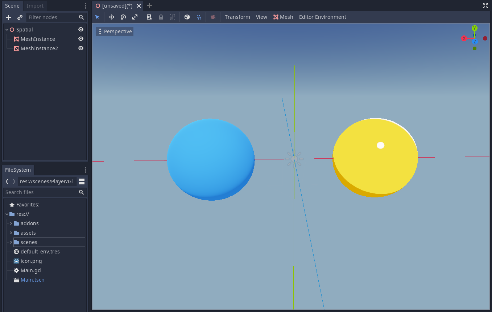
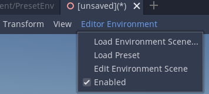

# QuickEnv

This tiny plugin for the [Godot Engine](https://godotengine.org/) allows you to load a custom scene as an environment in the 3D editor.

An environment scene can be any ordinary 3D scene which means you can include directional lights and even objects. This is especially useful for materials that rely on lights other than ambient being present in the scene (like the [cel shader material](https://github.com/EXPWorlds/Godot-Cel-Shader) by DaveTheDev in the image above) and allows you to work with these materials without adding nodes to the scene tree. It's also just a quick way to get a nice looking environment in the editor.

The plugin comes with a preset environment that can be quickly accessed via the `Load Preset` option. It attempts to replicate the environment from this Godot proposal: https://github.com/godotengine/godot-proposals/issues/348.

## How To Use

1. Open a 3D Scene in the editor.
2. Click `Editor Environment` in the 3D editor menu bar.
3. Select `Load Environment Scene...` to select a custom scene or `Load Preset` to include the preset environment included with this plugin.

* `Edit Environment Scene` will open the currently loaded environment scene in the editor.
* `Enabled` enables and disables the environment scene. (Note that this setting is global and *not* per-scene.)

To create your own custom environment scene, just create a 3D scene with the lights and environment you want and save it. You can then load it from the menu.

## Issues

* You can interact with objects inside the environment scene in the editor viewport (*not* the scene tree). However, changes to the environment will not be saved and reverted when you switch tabs or the scene is reloaded.
* Loading an environment that contains a `WorldEnvironment` node when editing a scene that already contains a `WorldEnvironment` scene will result in unexpected behaviour. A workaround is to disable the environment and refresh the scene (by switching tabs for reopening it).